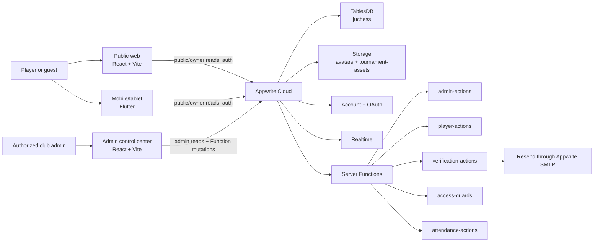
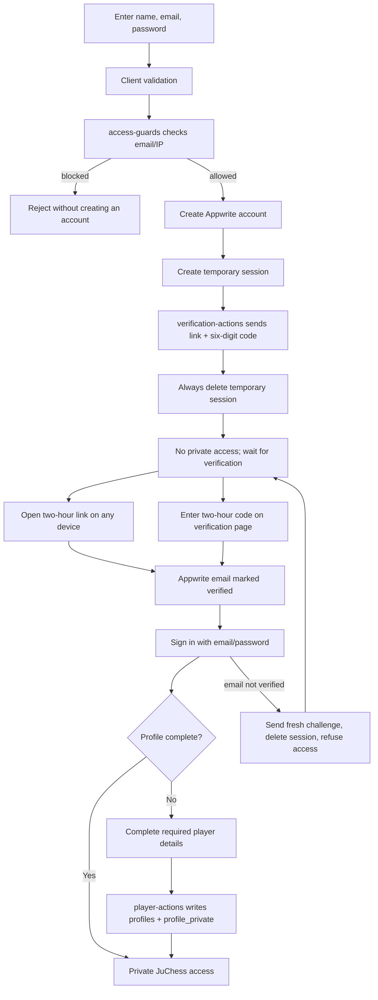
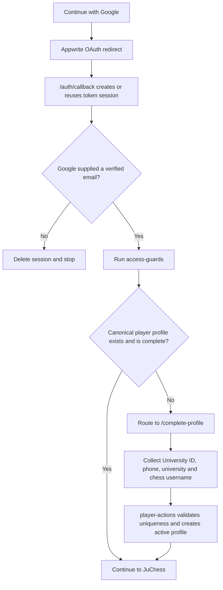
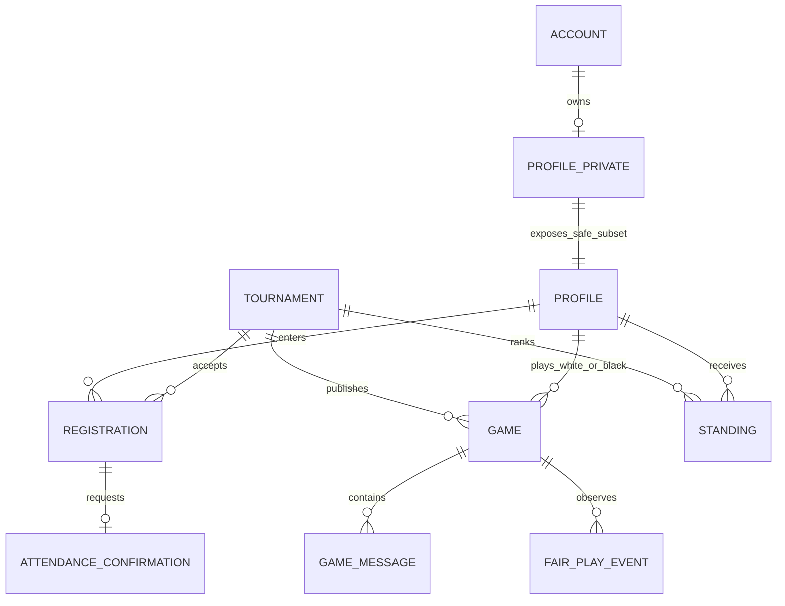
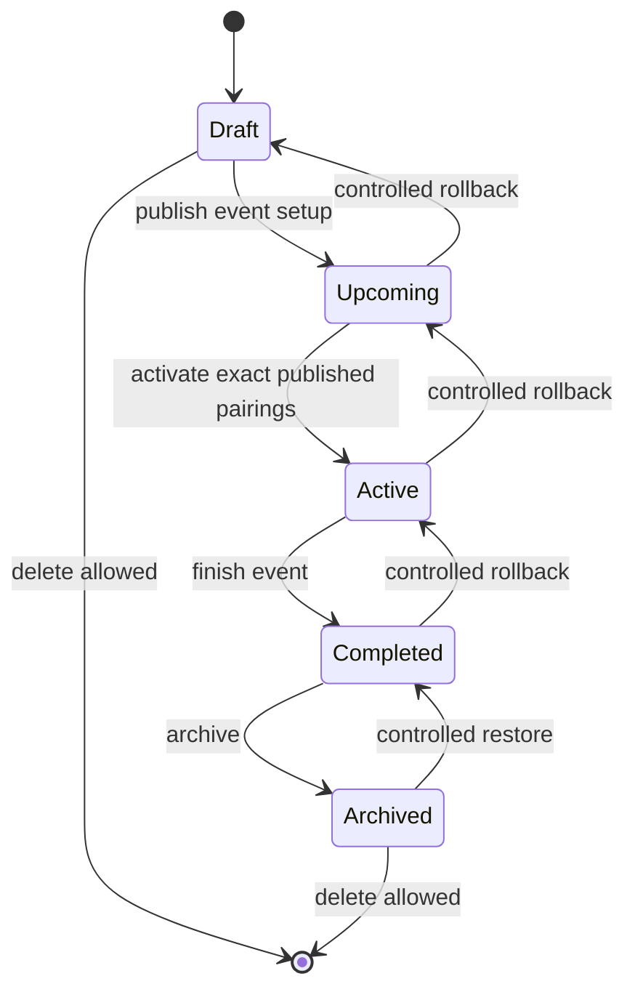
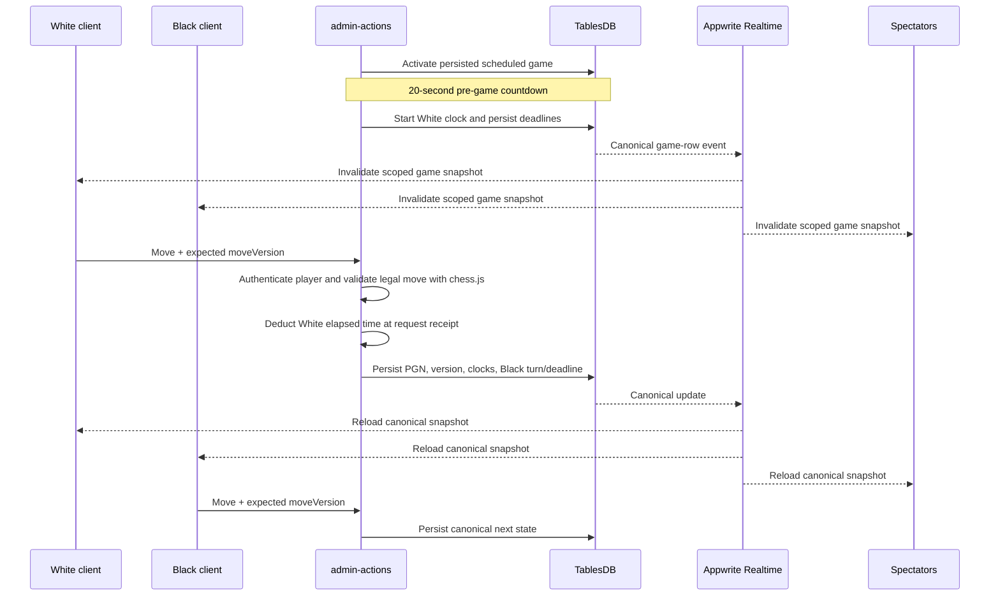
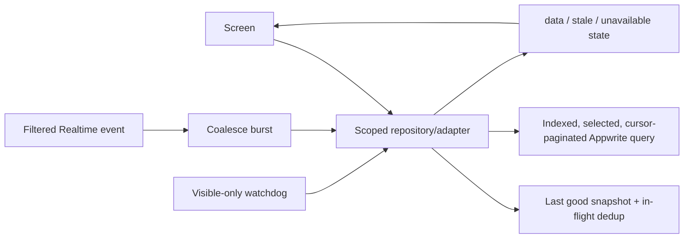
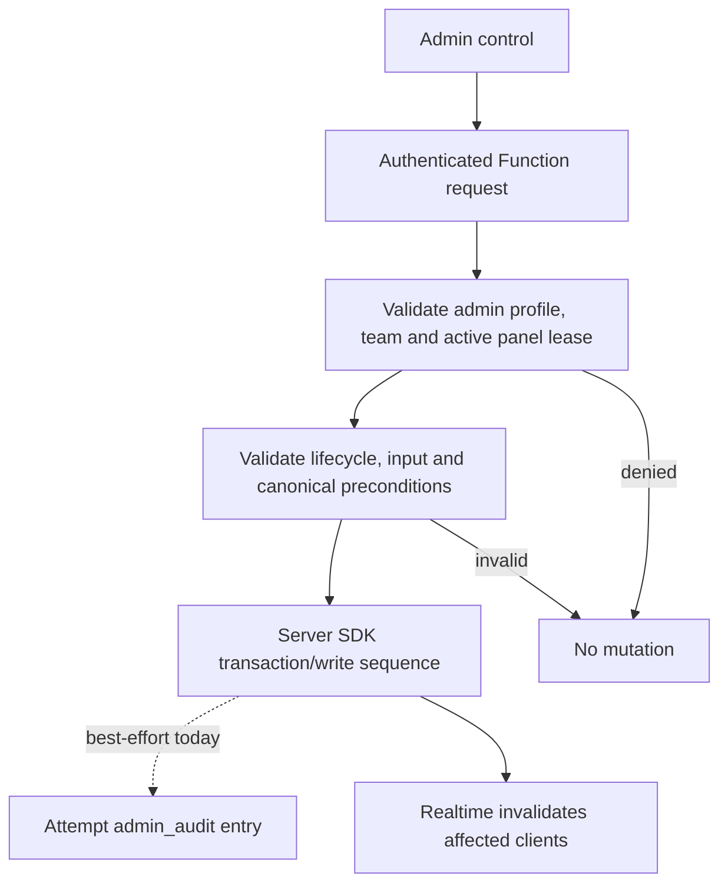
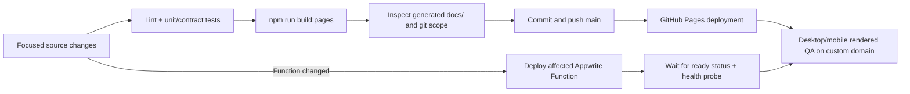

# JuChess system architecture

Architecture baseline reviewed: 2026-07-18

This document explains how the production JuChess platform works, where its trust boundaries are, and which data is authoritative. It is the engineering reference for the public website, admin control center, Flutter application, and Appwrite backend.

## 1. System context



The web and admin applications are built together into GitHub Pages. `/admin/` is the admin client; the remaining routes are the public client. The Flutter app uses the same Appwrite project and canonical rows.

## 2. Non-negotiable trust boundaries

1. **Appwrite Account owns identity and sessions.** A client cannot declare itself verified, active, or administrative.
2. **Private identity is separate from the public profile.** Email, University ID, and phone belong in `profile_private`, never in `profiles`.
3. **Functions own mutations that affect other people or competition state.** Admin authorization comes from private `admin_profiles` and Appwrite admin teams, not `profiles.role`.
4. **Tournament competition data becomes canonical only through the backend.** The admin client currently proposes opening pairings, but `admin-actions` validates the full participant set and format structure, canonicalizes knockout brackets, and commits games plus tournament metadata atomically. Moves, clocks, later-round progression, results, and standings are server-owned. Public/mobile clients only render persisted state.
5. **An unavailable dependency is not an empty dataset.** Clients preserve the last good snapshot or show an error; they must not turn failed reads into “no players,” “no pairings,” or “unpublished.”
6. **Realtime is an invalidation signal, not a second rules engine.** A notification causes a scoped canonical reload. A slow, visible-only fallback protects against blocked or disconnected Realtime.
7. **No client contains server credentials.** API keys, email-provider secrets, OAuth secrets, and SMTP credentials exist only in Appwrite or an authorized deployment environment.

## 3. Source and deployment map

| Surface | Main entry | Data boundary | Production destination |
|---|---|---|---|
| Public web | `apps/web/src/App.tsx` | `apps/web/src/lib/auth.ts`, `apps/web/src/lib/juchess.ts` | `https://juchess.page/` |
| Admin | `apps/admin/src/App.tsx` | `apps/admin/src/lib/adminData.ts` | `https://juchess.page/admin/` |
| Mobile | `apps/mobile/lib/main.dart` | `AppwriteService` and feature state in the Flutter app | Android/iOS build |
| Admin and hosted play | `appwrite/functions/admin-actions/src/main.js` | Server SDK, admin teams, audit rows | Appwrite Function `admin-actions` |
| Player profile and registration | `appwrite/functions/player-actions/src/main.js` | Verified account + private identity | Appwrite Function `player-actions` |
| Email verification | `appwrite/functions/verification-actions/src/main.js` | Two-hour hashed challenge | Appwrite Function `verification-actions` |
| Sign-up/sign-in access checks | `appwrite/functions/access-guards/src/main.js` | Identity/IP block lists | Appwrite Function `access-guards` |
| Attendance links | `appwrite/functions/attendance-actions/src/main.js` | Hashed attendance token | Appwrite Function `attendance-actions` |
| Pages build | `scripts/build-pages.mjs` | Builds both Vite clients | `docs/` on `main` |

The largest current maintainability hotspots are `apps/mobile/lib/main.dart`, `apps/admin/src/App.tsx`, and `appwrite/functions/admin-actions/src/main.js`. They should be split incrementally behind tested repositories and domain services; a big-bang rewrite would increase competition and authentication risk.

## 4. Account and membership lifecycle

An Appwrite account and an active JuChess member profile are different records. Verification proves control of an email; completing the player profile creates the active club identity.

### Email/password sign-up and sign-in



Important behavior:

- Verification links and six-digit codes expire after two hours. A resend invalidates older challenges.
- Codes are rate/attempt limited by the verification Function. Raw codes, link secrets, and email addresses are not stored in the challenge table; keyed hashes are stored.
- There is no durable “temporary member” session. An unverified Appwrite account may exist so it can receive verification, but it has no active public player profile and no private JuChess access.
- A verified account with missing required details is routed to profile completion. Required fields are full name, university, University ID, and phone; Chess.com and Lichess usernames are optional.
- Password recovery uses Appwrite’s recovery flow and returns a generic response so the UI does not disclose whether an email is registered.

### Google OAuth



Google sign-in and Google sign-up deliberately share one entry point. A verified Google identity with no JuChess profile is a new member candidate and must complete the required details. Apple remains hidden until real Apple credentials and callback handling exist.

## 5. Data ownership



| Dataset | Authority | Client behavior |
|---|---|---|
| `profiles` | `player-actions` and restricted admin operations | Public-safe member fields only; active rows may be visible publicly |
| `profile_private` | `player-actions`/admin server code | Owner/admin-only email, University ID, phone, account ID |
| `tournaments` | `admin-actions` | Clients display lifecycle and published snapshot |
| `registrations` | `player-actions` and `admin-actions` | Public participant association; no secrets |
| `games` | `admin-actions` | Canonical players, board, PGN, version, clock, turn deadlines and result |
| `standings` | `admin-actions` | Display in persisted rank order; never recalculate in clients |
| `game_messages` | `admin-actions` | Only the game’s players can read; writes lock after completion |
| `fair_play_events` | `admin-actions` | Server-written and admin-only; telemetry is a review signal, not proof of cheating |
| `attendance_confirmations` | attendance/admin Functions | Private response and delivery state |
| `email_verification_challenges` | `verification-actions` | Server-only hashed two-hour proofs |
| `admin_profiles`, block lists, audit rows | admin server code | Never use public profile role as authorization |

Every list that can grow beyond one Appwrite page must use cursor pagination. Queries used in live paths need indexes; in particular `games` is indexed by status, `(whiteProfileId,status)`, `(blackProfileId,status)`, and `(tournamentId,status)`.

## 6. Tournament lifecycle and publication



- Tournament creation exists only in Draft.
- Registration queue exists only in Upcoming; players cannot register once Active or Completed.
- Pairings/brackets are private drafts until Publish. Shuffle is locked after Publish.
- Publish accepts at most 96 games in one atomic transaction, validates the complete schedule, persists the exact game rows and canonical bracket snapshot, and refuses replacement until the schedule is unpublished. Activation must preserve the committed rows unchanged.
- Unpublish removes rounds and bracket data from every client.
- In-person Active/Completed tournaments may use the physical-board Procedure. JuChess-hosted online tournaments do not.
- Pure knockout public navigation is Registration, Players, Bracket; non-knockout is Registration, Players, Rounds, Standings. Completed events add Photos.
- Multi-stage is Swiss followed by single-elimination finals. Arena is rolling Swiss-like, not a complete Lichess Arena. Team currently lacks the full roster/board/match-point engine and must not be presented as complete.

## 7. Hosted online game sequence



The Function is the only chess clock and legal-move authority. Clients may show an optimistic piece move, but must reconcile it with the returned `moveVersion` and canonical state. White/Black board orientation is a view transformation only. Evaluation and analysis assistance remain disabled during competitive play, and an assigned player stays on their own unfinished board.

## 8. Read and refresh architecture

The preferred read path is:



Rules:

- Fetch by tournament/game/profile ID when a detail screen needs one entity; do not scan the whole database on a timer.
- Realtime subscriptions are filtered to the relevant tournament or row and cleaned up on route change/unmount.
- Burst events are coalesced, and only one refresh is in flight. If an event arrives mid-refresh, run one queued refresh afterward.
- Watchdog polling is slow, runs only while the document/app is visible, and protects against a disconnected Realtime channel.
- Completed immutable tournament views do not poll continuously.
- Keep the last good snapshot during a transient error and make management actions read-only until a complete canonical reload succeeds.
- Use Appwrite TTL only for non-live public summaries. A TTL cache is not a substitute for invalidating canonical game or tournament state.
- Engine work, external imports, and large route modules start only after explicit user intent and should be route-lazy.

## 9. Admin mutation and audit path



The control center must not simulate successful mutations in local React state. A disabled or unfinished feature is labeled unavailable. Canonical tournament load failures disable management actions rather than turning missing subreads into a publishable/unpublished state.

Audit writing is currently best-effort so an audit outage does not turn a completed competition mutation into a misleading client failure. This is an explicit reliability compromise: a future outbox/transactional audit design should make the competition write and its audit evidence durable together.

## 10. Build, deployment, and verification



Minimum proportional checks:

```text
npm run check:web
npm run check:admin
npm run check:functions
npm run test:functions
npm run check:email-templates
npm run mobile:analyze
npm run mobile:test
npm run build:pages
```

Function deployments are complete only when Appwrite reports the new deployment ready. A Pages change is complete only after the custom-domain route serves the new asset manifest and core routes render without console/runtime errors. Email transport is complete only after an approved real inbox receives and opens the expected message.

## 11. Current constraints and next architecture work

The following are explicit constraints, not hidden “working” features:

- Mobile authentication must maintain exact parity with the verified web lifecycle; OAuth callback behavior still requires real-device verification.
- Team and Arena formats are not full engines yet.
- Chess.com and Lichess imports need cursor/page continuation for large histories.
- Stockfish review is intentionally user-started and may still be slow on low-power devices.
- The heuristic Game Rating is not an official Chess.com or FIDE rating.
- Fair-play telemetry supports human review and never independently proves cheating.
- Opening pairings are still proposed in the admin browser. The backend now rejects invalid participant sets, repeated players/boards, incomplete round-robin matrices, invalid knockout entrants, replacement after publish, and non-atomic schedules; moving proposal generation itself behind a server preview token remains the next trust-boundary improvement.
- Tournament media upload, delete, and metadata changes still use direct authorized Storage operations rather than a Function lease/audit path. Bucket permissions remain the enforcement boundary until that workflow is moved server-side.
- Atomic opening publication is capped at 96 game rows to stay below the smallest Appwrite transaction-operation limit with metadata headroom. Larger full round-robin fields require a future server-side staged proposal design, not partial publication.
- Some mobile tournament aggregation and public summary paths still perform broad paginated reads. They are correct and bounded, but should be replaced by scoped repositories/materialized summaries before dataset growth makes them expensive.
- Admin audit writes are best-effort and some legacy mutations still need complete audit coverage.
- The Flutter monolith and the admin root component should be decomposed incrementally into feature repositories, view models/hooks, and route-level components with stale-response tests.
- `admin-actions` is also a large multi-domain Function. Split it by authorization, tournament lifecycle, hosted play, communications, and reporting only after shared contracts and deployment routing tests exist.
- Schema changes need additive migrations, index-ready verification, and compatibility handling before old paths are removed.

When implementation and this document disagree, canonical backend invariants win. Update the implementation and this document in the same release so the architecture remains executable rather than aspirational.
